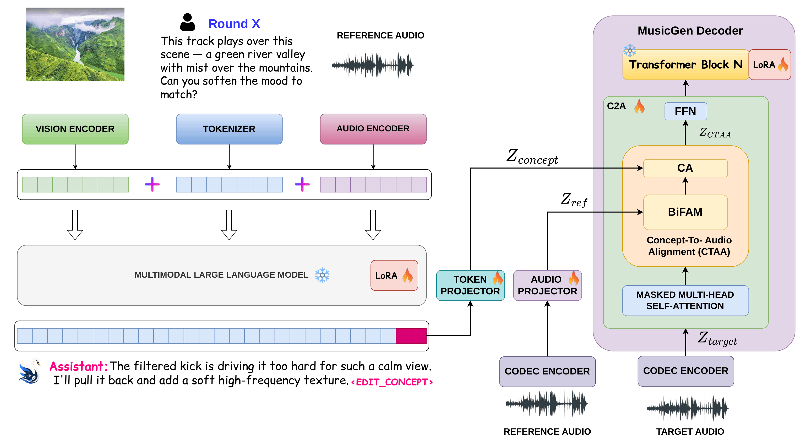

# AURA: Unified Multimodal Framework for Conversational Music Editing

**Quoc-Huy Trinh**¹⁴  ·  **Minh-Van Nguyen**²⁴  ·  **Debesh Jha**³

¹ Aalto University  ·  ² Technical University of Denmark  ·  ³ University of South Dakota  ·  ⁴ OpenRB Lab

[](https://arxiv.org/abs/2609.14344)
[](https://huggingface.co/OpenRB-Lab/AURA)
[](https://huggingface.co/datasets/OpenRB-Lab/AURA-Chat-Edit)
[](https://openrb-lab.github.io/AURA-demo/)

<p align="center">
  
</p>

Chat with a song, ask for edits in natural language, get edited audio back.

## News
- [x] [2026.9.13] [AURA model](https://huggingface.co/OpenRB-Lab/AURA) and [AURA-Chat-Edit dataset](https://huggingface.co/datasets/OpenRB-Lab/AURA-Chat-Edit) are released on Hugging Face!
- [x] [2026.9.13] Training, inference, and evaluation code is released. Checkpoints and demo coming soon!
- [x] [2026.9.13] [AURA paper](https://arxiv.org/abs/TODO) is released on arXiv. Welcome to check it out!

**Architecture**: a Qwen2.5-Omni-7B thinker (LoRA-tuned) listens to the music
and the request, replies conversationally, and emits a typed edit-token block
`[EDIT_<KIND>][EDIT_0..7]` (7 kinds: ADD / REMOVE / REPLACE / EXTRACT /
REBALANCE / EFFECT / MOOD). The 9 hidden states at those tokens condition a
**dual-stream fusion MusicGen bridge** (frozen MusicGen-medium decoder; a
music-free source stream fused per layer via bi-dual cross-attention + gated
FiLM; edit tokens as cross-attention K/V with LoRA) that renders the edited
audio through EnCodec. Localized edits are code-anchored outside the requested
segment and seam-crossfaded.

---

## 1. Installation

```bash
conda env create -f src/environment.yml     # creates env "music-edit"
conda activate music-edit
```

Notes:
- Model weights (Qwen2.5-Omni-7B, MusicGen-medium, MuQ-MuLan, CLAP)
  auto-download on first use into `weights/` (set `HF_HUB_CACHE=$PWD/weights`).
- Trained adapters are expected under `ckpts/edit_agent/` (not in git).
- The code disables cuDNN at import (`torch.backends.cudnn`) — no action needed.
- Optional MultiBand-Diffusion decoding needs a separate audiocraft env.

## 2. Dataset generation

The training data is built in stages (all under `data/edit_dataset/`):

```bash
# a) Slakh stem-edit pairs (exact mixes; add/remove/isolate/rebalance/swap)
python src/edit_agent/slakh_edits.py \
    --slakh-root data/edit_dataset/slakh_raw/slakh2100_flac_redux/train \
    --max-tracks 600 --pairs-per-chunk 2 --traj-per-track 1
#    (--ops isolate to restrict ops; --force-split test for held-out builds)

# b) Conversations for the pairs (needs an OpenAI-compatible LLM endpoint,
#    see src/data_utils/llm_client.py — default http://localhost:9003)
python src/edit_agent/synth_dialogues_slakh.py --workers 16

# c) Bridge training caches: manifest -> hidden states -> EnCodec codes
python src/edit_agent/precompute_bridge.py --phase manifest
python src/edit_agent/precompute_bridge.py --phase hidden   # GPU; SFT thinker
python src/edit_agent/precompute_encodec.py                 # GPU (needs hidden first)

# d) Optional data-quality score used by --silence-filter
python src/edit_agent/filter_silence.py
```

Held-out evaluation sets:
```bash
# Instruct-MusicGen-comparable benchmark from the Slakh TEST split
python src/edit_agent/build_impg_benchmark.py     # -> results/impg_bench/
```

## 3. Training

**Stage 1 — thinker SFT** (edit-token emission + music chat; see
`train_sft.py`): produces `ckpts/edit_agent/sft/final`.

**Stage 2 — bridge** (MusicGen fusion adapter on cached hidden states):
```bash
torchrun --nproc_per_node=2 src/edit_agent/train_musicgen_bridge.py \
    --arch fusion --lora-r 64 --lora-alpha 128 \
    --batch 8 --accum 2 --steps 40000 --lr 5e-5 --silence-filter
# checkpoints -> ckpts/edit_agent/musicgen_fusion/step_*
# IMPORTANT: select checkpoints with the audio probe, never with CE:
python src/edit_agent/probe_musicgen.py \
    --adapter ckpts/edit_agent/musicgen_fusion/step_30000 --arch fusion
```

**Stage 3 — joint** (live thinker + bridge; loss = λ·CE_musicgen + (1−λ)·CE_LM,
the LM term is Qwen's built-in loss and keeps chat/QA ability):
```bash
python src/edit_agent/train_joint.py --arch fusion \
    --mg-init ckpts/edit_agent/musicgen_fusion/step_30000 \
    --steps 4000 --lam 0.5
# -> ckpts/edit_agent/joint/final/{qwen,musicgen}
```

**Verification**: `verify_sft.py` (edit-token emission), `eval_musicgen.py`
(60-clip benchmark + FAD), `run_impg_bench.py` + `score_impg_bench.py`
(FAD/CLAP/KL/SSIM/P-Demucs/SI-SDR vs published baselines).

## 4. Serving

### HTTP API (production path)

```bash
API_GPU=1 API_PORT=9004 bash src/scripts/serve_musicgen_api.sh
```
Endpoints (`docs/API.md` has full schemas + clients; Swagger at `/docs`):
- `POST /chat` `{text, audio(base64)}` → `{text}`
- `POST /edit` `{text, audio(base64), segment?, guidance?, seed?}` →
  `{text, audio(base64 wav 32 kHz), ...}`

### Gradio web UI (interactive testing)

The Gradio app chats with the thinker, chunks an uploaded song, and sends edit
requests to a render worker. Point it at the production API:

```bash
# terminal 1 — the model API (render worker)
API_GPU=1 API_PORT=9004 bash src/scripts/serve_musicgen_api.sh

# terminal 2 — the Gradio UI
WORKER_URL=http://127.0.0.1:9004 \
SFT_ADAPTER=ckpts/edit_agent/joint_fusion_r64/final/qwen \
WEBAPP_PORT=7862 CUDA_VISIBLE_DEVICES=0 \
conda run -n music-edit python src/edit_agent/webapp.py
```
Open `http://localhost:7862`: upload a song, pick a chunk, chat
("make the chorus more energetic", "remove the drums from 4 to 8 seconds") and
listen to rendered edits inline. The API accepts the webapp's legacy `prompt`
field, so no further glue is needed.

---

## Citation

```bibtex
@misc{trinh2026auraunifiedmultimodalframework,
      title={AURA: Unified Multimodal Framework for Conversational Music Editing}, 
      author={Quoc-Huy Trinh and Minh-Van Nguyen and Debesh Jha},
      year={2026},
      eprint={2609.14344},
      archivePrefix={arXiv},
      primaryClass={cs.SD},
      url={https://arxiv.org/abs/2609.14344}, 
}
```
